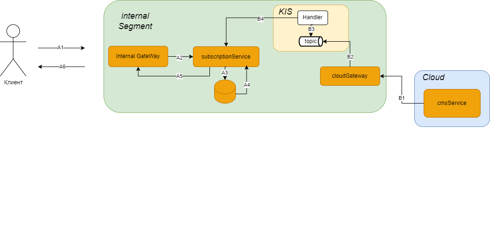
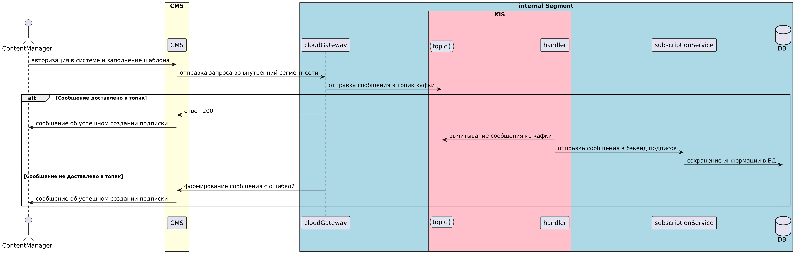
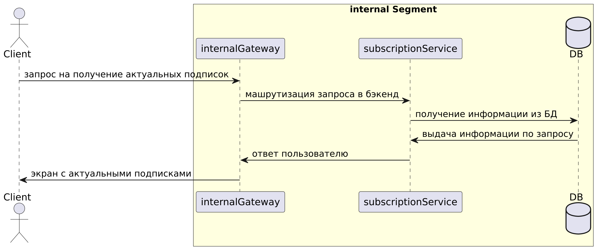

| Название проекта | Подписки для пользователей                                                            |
| ---------------- | ------------------------------------------------------------------------------------- |
| Цель             | Упростить процесс создания медиа-подписок для пользователей                           |
| Описание         | Я как контент-менеджер, хочу упростить бизнес-процесс по созданию подписок через CMS. |
## Глоссарий

| Термин              | Описание                                                                                                                                                    |
| ------------------- | ----------------------------------------------------------------------------------------------------------------------------------------------------------- |
| cmsService          | CMS система для управления и создания подписок                                                                                                              |
| cloudGateway        | Обработчик запросов для back-to-back взаимодействия с сервисом CMS                                                                                          |
| KIS                 | Kafka Integration Service - сервис для асинхронного взаимодействия через kafka. В него пишет сообщение **cloudGateway**, вычитывает **subscriptionService** |
| subscriptionService | Бэкенд сервиса подписок                                                                                                                                     |
| internalGateway     | Обработчик запросов для связи с deepback. В данном случаем с subscriptionService                                                                            |

## Общие сведения

### Краткое описание (Зачем?)

Предоставить пользователю возможность ознакомиться с медиа-подписками, которые предоставляет банк.

Создать инструменты, с помощью которого этим всем будет удобно управлять.

Для модератора необходимо зайти в CMS в свою учётную запись и заполнить определенные параметры.
### Аудитория (Для кого?)

Клиенты банка. 

## Компонентная схема

### Описание взаимодействий

| ИД взаимодействия | Описание взаимодействия                                                                     |
| ----------------- | ------------------------------------------------------------------------------------------- |
| А1                | Клиента отправляет запрос на получение доступных подписок                                   |
| А2                | internalGateway маршрутизирует запрос в subscriptionService                                 |
| А3                | subscriptionService отправляет запрос в БД на получение всех имеющихся подписок.            |
| А4                | БД возвращает результат запроса                                                             |
| А5                | subscriptionService отправляет ответ                                                        |
| А6                | Клиент получает актуальную информацию по подпискам                                          |
| В1                | Контент-менеджер авторизуется в CMS системе и заполняет шаблон подписки. Отправляет запрос  |
| В2                | cloudGateway обрабатывает запрос из CMS, далее отправляет сообщение в топик кафки           |
| В3                | На стороне KIS есть обработчик, который слушает топик кафки и вычитывает из него сообщения. |
| В4                | После вычитки сообщения handler отправляет запрос в subscriptionService                     |
## Описание сценария бизнес-процесса

### Создание подписки контент-менеджером

### Получение доступных подписок пользователей

